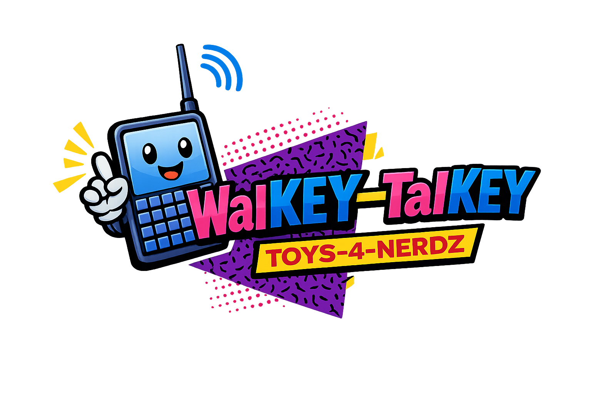

<p align="center">
  
</p>

# WalKEY-TalKEY

It's a push-to-talk microphone array, macro keyboard, air mouse, gesture touch support, thumb drive, ALL AT ONCE -- crammed into one tiny [AMOLED touchscreen](https://www.amazon.com/dp/B0F7XTJ7JW) that sits right next to your keyboard and talks to your computer over USB.

Swipe it. Tap it. Hold it. Every gesture fires off whatever you tell it to -- keyboard shortcuts, media controls, multi-step macros, you name it. Smash the Menu button to swap modes on the fly. Or just have your AI of choice configure it through its own [MCP server](https://www.npmjs.com/package/walkey-talkey-mcp) -- no code required. Prefer a hands-on approach? There's a built-in Wi-Fi web portal and [REST API](docs/REST_API.md) too.

**It literally programs itself, and makes the perfect gift for the vibe coder in your life.** And because it shows up as a standard USB keyboard, you can supercharge it even further with [AutoHotkey](https://www.autohotkey.com/) on Windows or [Karabiner-Elements](https://karabiner-elements.pqrs.org/) on macOS. Sky's the limit!

<small>\*Batteries not included.</small>

## What It Does

| Function              | How It Works                                                                                                                 |
| --------------------- | ---------------------------------------------------------------------------------------------------------------------------- |
| **Macro keyboard**    | Swipe or tap the touchscreen to send keyboard shortcuts, key combos, or multi-step macros to your PC                         |
| **Push-to-talk mic**  | Hold your finger on the screen to activate the built-in microphone -- release to mute. Great for dictation and voice chat    |
| **Media controller**  | Switch to Media mode and control play/pause, skip tracks, and volume with swipes                                             |
| **Air mouse**         | Tilt the device to move your cursor using the built-in 6-axis IMU gyroscope -- no surface needed. Tap to click, hold to drag |
| **Touch trackpad**    | Use the touchscreen as a traditional trackpad -- drag to move the cursor, tap to click, tap-drag for drag-and-drop           |
| **SD card recording** | Enable recording mode and every mic activation also writes a WAV file to the SD card for later review                        |
| **Thumb drive**       | The device also shows up as a USB storage drive for quick file transfers                                                     |
| **Mode switcher**     | Hold the BOOT button and swipe to cycle through modes on the fly                                                             |

Your computer sees it as a standard USB keyboard, mouse, microphone, and storage device. No special drivers needed.

## Hardware

WalKEY-TalKEY runs on the [Waveshare ESP32-S3 Touch AMOLED 1.75"](https://github.com/waveshareteam/ESP32-S3-Touch-AMOLED-1.75) development board -- a compact watch-sized touchscreen with a powerful wireless microcontroller inside.

**[Get one on Amazon](https://www.amazon.com/dp/B0F7XTJ7JW)**

The board features a 466x466 pixel AMOLED display, capacitive touch, dual digital microphones, Wi-Fi, Bluetooth, and USB-C -- all in a form factor small enough to sit next to your keyboard.

## Built-In Modes

The device ships with five modes, and you can add, remove, or modify as many custom modes as you want:

| Mode             | What It Does                                                                                                                  |
| ---------------- | ----------------------------------------------------------------------------------------------------------------------------- |
| **Cursor**       | Designed for AI coding assistants. Hold to dictate, tap to accept, swipe for shortcuts like new chat, submit, and clear field |
| **Presentation** | Control slideshows. Swipe for next/previous slide, tap to advance, double-tap to black the screen, hold for air mouse cursor  |
| **Media**        | Tap for play/pause, swipe left/right to skip tracks, swipe up/down for volume                                                 |
| **Navigation**   | Swipe in any direction to send arrow keys. Tap or double-tap for Escape                                                       |
| **Mouse**        | Built-in mode that turns the device into a full USB mouse. Choose air mouse (gyro) or touch trackpad in config                |

To switch modes, hold the BOOT button on the side of the device and swipe left or right.

## First-Time Setup: Connect to Wi-Fi

The device needs to be on your Wi-Fi network before the web portal or MCP tools can reach it. On first boot (or if it can't find a saved network), it creates its own Wi-Fi access point:

1. **Join the device's network** from your phone or computer:
   - SSID: `walkey-talkey`
   - Password: `secretKEY`
2. **Open the config portal** at **`http://192.168.4.1`**
3. **Enter your home/office Wi-Fi credentials** in the portal and hit Save
4. The device reboots onto your network and becomes available at **`http://walkey-talkey.local`**

Once connected, the web portal and MCP tools both work over your local network. You only need to do this once -- the device remembers your Wi-Fi settings across reboots.

## Configuration

Every gesture and action is defined in a single JSON config file. There are three ways to edit it:

### Web Portal

After the initial Wi-Fi setup above, browse to:

- **`http://walkey-talkey.local`** (recommended)
- **`http://192.168.4.1`** (if connected directly to the device's AP fallback)

The portal lets you load, validate, save, and reset the config with a visual editor -- no code required. It also serves the schema and documentation files directly.

### MCP (AI-Powered Editing)

The [walkey-talkey-mcp](https://www.npmjs.com/package/walkey-talkey-mcp) package lets AI assistants in **Cursor** and **Claude Code** read and update your device config through natural language.

#### Example: Building a "Spotify" Mode With MCP

Here is a real example of a custom media-controller mode created entirely through natural-language conversation with an AI assistant. No JSON was edited by hand.

**Step 1 -- Create the mode:**

> _"Create a new mode called Spotify for media control. Tap should play/pause, swipe right for next track, swipe left for pause."_

The AI calls `walkey_create_mode` with the base mode definition and `walkey_set_binding` for each gesture. The device config updates live.

**Step 2 -- Add volume macros:**

> _"Make swipe up increase volume by 10 steps and swipe down decrease by 10 steps."_

The AI builds a multi-step macro -- 10 `VOLUME_UP` taps with `sleep_ms` gaps between each -- and writes it as a single swipe-up binding. Same for swipe-down with `VOLUME_DOWN`. One sentence from you, one save to the device.

**Step 3 -- Add push-to-talk:**

> _"When I hold the screen, mute the computer and activate the onboard mic. When I release, unmute the computer again and deactivate the mic."_

The AI creates `hold_start` and `hold_end` bindings that pair `mic_gate` with `MUTE` toggling. The result is a push-to-talk media mode where you can jump into a voice call or talk to an AI without your music getting in the way.

**What ended up on the device:**

| Gesture     | Action                                  |
| ----------- | --------------------------------------- |
| Tap         | Play / Pause                            |
| Swipe right | Next track                              |
| Swipe left  | Pause                                   |
| Swipe up    | Volume up x10                           |
| Swipe down  | Volume down x10                         |
| Hold        | Mute system + activate onboard mic      |
| Release     | Un-mute system + deactivate onboard mic |

All seven bindings were created, validated, and saved to the device through conversation. The MCP package exposes 27 tools that let the AI make precise, targeted edits without accidentally overwriting unrelated settings.

#### Setup

**Cursor** -- add to `.cursor/mcp.json`:

```json
{
  "mcpServers": {
    "walkey-talkey": {
      "command": "npx",
      "args": ["walkey-talkey-mcp"]
    }
  }
}
```

**Claude Code:**

```bash
claude mcp add walkey-talkey npx walkey-talkey-mcp
```

Then just ask things like _"Add a gaming mode with WASD bindings"_ or _"Change my tap action in Cursor mode to send Enter"_.

### Manual JSON

Edit the config file directly at `config/mode-config.json`. The [User Guide](docs/USER_GUIDE.md) explains every field, action type, and authoring pattern in detail.

## Getting Started

1. **Get the board** -- [Waveshare ESP32-S3 Touch AMOLED 1.75"](https://www.amazon.com/dp/B0F7XTJ7JW)
2. **Flash the firmware** -- plug in over USB-C and run:

```powershell
.\flash.ps1                # build + flash (COM4 default)
.\flash.ps1 -Port COM5     # use a different port
```

3. **Use it** -- the device appears as a USB keyboard, microphone, and drive. Start swiping.
4. **Customize it** -- open `http://walkey-talkey.local` or use the MCP package to reconfigure modes and gestures.

For full build instructions, hardware details, and developer reference, see [Technical Details](docs/TECHNICAL.md).

## Documentation

| Document                                               | What It Covers                                                                              |
| ------------------------------------------------------ | ------------------------------------------------------------------------------------------- |
| [User Guide](docs/USER_GUIDE.md)                       | Setup, JSON config authoring, portal access, MCP setup, and troubleshooting                 |
| [REST API Reference](docs/REST_API.md)                 | Full HTTP endpoint docs with examples for every route the device exposes                    |
| [Technical Details](docs/TECHNICAL.md)                 | Hardware specs, build process, firmware architecture, USB behavior, and developer reference |
| [AI Guide](docs/AI_GUIDE.md)                           | Standalone guide for AI assistants generating or repairing configs                          |
| [Mode System Reference](docs/mode-system-reference.md) | Deep runtime semantics and binding execution model                                          |
| [Config Schema](config/mode-config.schema.json)        | Machine-readable JSON schema for validation and editor tooling                              |

## Contributing

1. Fork the repository
2. Create a branch for your feature or fix
3. Commit with clear descriptions
4. Submit a pull request
